# [Final Task] Prediction Model - Jordan Marcelino

## Domain Proyek

Proyek ini melibatkan perusahaan _multifinance_ sebagai klien. Tujuannya adalah untuk meningkatkan keakuratan penilaian dan pengelolaan risiko kredit, sehingga dapat mengoptimalkan keputusan bisnis dan meminimalkan potensi kerugian. Model machine learning akan dikembangkan untuk memprediksi risiko kredit menggunakan data pinjaman historis.

## Business Understanding

Untuk dapat mengoptimalkan keputusan bisnis dan meminimalkan potensi kerugian, proyek ini melakukan analisis terhadap dataset dengan pendekatan machine learning menggunakan algoritma klasifikasi.

### Problem Statements

-   Bagaimana efektivitas pendekatan _machine learning_ dalam memprediksi risiko kredit dilihat dari nilai metriks: akurasi, presisi, recall, dan f1-score?

### Goals

-   Mengevaluasi efektivitas pendekatan _machine learning_ dalam memprediksi risiko kredit dengan melihat nilai metriks: akurasi, presisi, recall, dan f1-score

    ### Solution statements

    -   Membandingkan 2 algoritma klasifikasi yaitu: Logistic Regression dan Random Forest. Kedua model akan diimprove dengan hyperparameter tuning menggunakan grid search dan cross validation dengan split sebanyak 3. f1-score digunakan sebagai nilai metrik utama dalam membandingkan masing-masing algoritma.

## Data Understanding

Data yang digunakan dalam proyek ini diambil dari [Rakamin LMS](https://rakamin-lms.s3.ap-southeast-1.amazonaws.com/vix-assets/idx-partners/loan_data_2007_2014.csv). Terdapat 1 dataset yang disediakan yaitu:

1.  loan_data_2007_2014.csv

### Variabel-variabel pada dataset adalah sebagai berikut:

| Nama kolom                  | Keterangan                                                                                                                                                                                                                                         |
| --------------------------- | -------------------------------------------------------------------------------------------------------------------------------------------------------------------------------------------------------------------------------------------------- |
| acc_now_delinq              | Jumlah rekening dimana peminjam sekarang menunggak.                                                                                                                                                                                                |
| addr_state                  | Negara yang disediakan oleh peminjam dalam permohonan pinjaman                                                                                                                                                                                     |
| all_util                    | Saldo hingga batas kredit pada semua perdagangan                                                                                                                                                                                                   |
| annual_inc                  | Pendapatan tahunan yang dilaporkan sendiri yang diberikan oleh peminjam saat pendaftaran.                                                                                                                                                          |
| annual_inc_joint            | Gabungan pendapatan tahunan yang dilaporkan sendiri yang diberikan oleh peminjam bersama pada saat pendaftaran                                                                                                                                     |
| application_type            | Menunjukkan apakah pinjaman tersebut merupakan permohonan perorangan atau permohonan bersama dengan dua peminjam bersama                                                                                                                           |
| collection_recovery_fee     | biaya pos dari biaya pengumpulan                                                                                                                                                                                                                   |
| collections_12_mths_ex_med  | Jumlah koleksi dalam 12 bulan tidak termasuk koleksi medis                                                                                                                                                                                         |
| delinq_2yrs                 | Jumlah tunggakan tunggakan lebih dari 30 hari dalam arsip kredit peminjam selama 2 tahun terakhir                                                                                                                                                  |
| desc                        | Deskripsi pinjaman yang diberikan oleh peminjam                                                                                                                                                                                                    |
| dti_joint                   | Rasio yang dihitung menggunakan total pembayaran bulanan peminjam bersama atas total kewajiban utang, tidak termasuk hipotek dan pinjaman LC yang diminta, dibagi dengan gabungan pendapatan bulanan yang dilaporkan sendiri oleh peminjam bersama |
| earliest_cr_line            | Bulan dimana batas kredit peminjam yang dilaporkan paling awal dibuka                                                                                                                                                                              |
| emp_length                  | Lamanya masa kerja dalam tahun. Nilai yang mungkin adalah antara 0 dan 10 dimana 0 berarti kurang dari satu tahun dan 10 berarti sepuluh tahun atau lebih.                                                                                         |
| emp_title                   | Jabatan yang diberikan oleh Peminjam saat mengajukan pinjaman.\*                                                                                                                                                                                   |
| funded_amnt                 | Jumlah total yang berkomitmen untuk pinjaman tersebut pada saat itu.                                                                                                                                                                               |
| grade                       | LC menetapkan tingkat pinjaman                                                                                                                                                                                                                     |
| home_ownership              | Status kepemilikan rumah yang diberikan oleh peminjam pada saat pendaftaran. Nilai-nilai kami adalah: SEWA, SENDIRI, KPR, LAINNYA.                                                                                                                 |
| id                          | ID unik yang ditetapkan LC untuk daftar pinjaman.                                                                                                                                                                                                  |
| il_util                     | Rasio total saldo saat ini terhadap kredit/batas kredit yang tinggi pada semua akun pemasangan                                                                                                                                                     |
| initial_list_status         | Status pencatatan awal pinjaman. Nilai yang mungkin adalah – Utuh, Pecahan                                                                                                                                                                         |
| inq_fi                      | Jumlah pertanyaan keuangan pribadi                                                                                                                                                                                                                 |
| inq_last_12m                | Jumlah pertanyaan kredit dalam 12 bulan terakhir                                                                                                                                                                                                   |
| inq_last_6mths              | Jumlah pertanyaan dalam 6 bulan terakhir (tidak termasuk pertanyaan otomotif dan hipotek)                                                                                                                                                          |
| installment                 | Pembayaran bulanan yang harus dibayar oleh peminjam jika pinjaman itu berasal.                                                                                                                                                                     |
| int_rate                    | Menunjukkan apakah pendapatan telah diverifikasi oleh LC, tidak diverifikasi, atau jika sumber pendapatan telah diverifikasi                                                                                                                       |
| issue_d                     | Bulan dimana pinjaman itu didanai                                                                                                                                                                                                                  |
| last_credit_pull_d          | Bulan terakhir LC menarik kredit untuk pinjaman ini                                                                                                                                                                                                |
| last_pymnt_amnt             | Jumlah total pembayaran terakhir yang diterima                                                                                                                                                                                                     |
| last_pymnt_d                | Pembayaran bulan lalu telah diterima                                                                                                                                                                                                               |
| loan_amnt                   | Pembayaran bulan lalu telah diterima                                                                                                                                                                                                               |
| loan_status                 | Status pinjaman saat ini                                                                                                                                                                                                                           |
| max_bal_bc                  | Saldo terhutang maksimum saat ini pada semua akun bergulir                                                                                                                                                                                         |
| member_id                   | LC unik yang menetapkan Id untuk anggota peminjam.                                                                                                                                                                                                 |
| mths_since_last_delinq      | Jumlah bulan sejak tunggakan terakhir peminjam.                                                                                                                                                                                                    |
| mths_since_last_major_derog | Bulan sejak rating 90 hari terakhir atau lebih buruk                                                                                                                                                                                               |
| mths_since_last_record      | Jumlah bulan sejak pencatatan publik terakhir.                                                                                                                                                                                                     |
| mths_since_rcnt_il          | Bulan sejak rekening cicilan terakhir dibuka                                                                                                                                                                                                       |
| next_pymnt_d                | Tanggal pembayaran terjadwal berikutnya                                                                                                                                                                                                            |
| open_acc                    | Jumlah jalur kredit terbuka dalam file kredit peminjam.                                                                                                                                                                                            |
| open_acc_6m                 | Jumlah perdagangan terbuka dalam 6 bulan terakhir                                                                                                                                                                                                  |
| open_il_12m                 | Jumlah perdagangan terbuka dalam 6 bulan terakhir                                                                                                                                                                                                  |
| open_il_24m                 | Jumlah rekening angsuran yang dibuka dalam 24 bulan terakhir                                                                                                                                                                                       |
| open_il_6m                  | Jumlah rekening angsuran yang dibuka dalam 12 bulan terakhir                                                                                                                                                                                       |
| open_rv_12m                 | Jumlah perdagangan bergulir yang dibuka dalam 12 bulan terakhir                                                                                                                                                                                    |
| open_rv_24m                 | Jumlah perdagangan bergulir yang dibuka dalam 24 bulan terakhir                                                                                                                                                                                    |
| out_prncp                   | Sisa pokok terutang untuk jumlah total yang didanai                                                                                                                                                                                                |
| out_prncp_inv               | Sisa pokok terutang untuk sebagian dari jumlah total yang didanai oleh investor                                                                                                                                                                    |
| policy_code                 | policy_code=1 yang tersedia untuk umum produk baru tidak tersedia untuk umum policy_code=2                                                                                                                                                         |
| pub_rec                     | Jumlah catatan publik yang menghina                                                                                                                                                                                                                |
| purpose                     | Kategori yang disediakan oleh peminjam untuk permintaan pinjaman.                                                                                                                                                                                  |
| pymnt_plan                  | Menunjukkan apakah rencana pembayaran telah diterapkan untuk pinjaman                                                                                                                                                                              |
| recoveries                  | Menunjukkan apakah rencana pembayaran telah diterapkan untuk pinjaman                                                                                                                                                                              |
| revol_bal                   | Total saldo kredit bergulir                                                                                                                                                                                                                        |
| revol_util                  | Tingkat pemanfaatan jalur bergulir, atau jumlah kredit yang digunakan peminjam relatif terhadap seluruh kredit bergulir yang tersedia.                                                                                                             |
| sub_grade                   | LC menetapkan tanah dasar pinjaman                                                                                                                                                                                                                 |
| term                        | Jumlah pembayaran pinjaman. Nilai dalam bulan dan dapat berupa 36 atau 60.                                                                                                                                                                         |
| title                       | Judul pinjaman yang diberikan oleh peminjam                                                                                                                                                                                                        |
| tot_coll_amt                | Total jumlah penagihan yang terutang                                                                                                                                                                                                               |
| tot_cur_bal                 | Total saldo saat ini dari semua akun                                                                                                                                                                                                               |
| total_acc                   | Jumlah total batas kredit yang saat ini ada dalam arsip kredit peminjam                                                                                                                                                                            |
| total_bal_il                | Total saldo saat ini dari semua rekening angsuran                                                                                                                                                                                                  |
| total_cu_tl                 | Jumlah perdagangan keuangan                                                                                                                                                                                                                        |
| total_pymnt                 | Pembayaran diterima sampai saat ini untuk jumlah total yang didanai                                                                                                                                                                                |
| total_pymnt_inv             | Pembayaran diterima hingga saat ini untuk sebagian dari jumlah total yang didanai oleh investor                                                                                                                                                    |
| total_rec_int               | Bunga yang diterima sampai saat ini                                                                                                                                                                                                                |
| total_rec_late_fee          | Biaya keterlambatan diterima sampai saat ini                                                                                                                                                                                                       |
| total_rec_prncp             | Kepala Sekolah diterima sampai saat ini                                                                                                                                                                                                            |
| url                         | URL untuk halaman LC dengan data daftar.                                                                                                                                                                                                           |
| zip_code                    | 3 angka pertama kode pos yang diberikan peminjam dalam permohonan pinjaman.                                                                                                                                                                        |

### EDA (Exploratory Data Analysis)

-   Deskriptif data

    | #   | Column                    | Non-Null Count  | Dtype   |
    | --- | ------------------------- | --------------- | ------- |
    | 0   | id                        | 466285 non-null | int64   |
    | 1   | member_id                 | 466285 non-null | int64   |
    | 2   | loan_amnt                 | 466285 non-null | int64   |
    | 3   | funded_amnt               | 466285 non-null | int64   |
    | 4   | funded_amnt_inv           | 466285 non-null | float64 |
    | 5   | term                      | 466285 non-null | object  |
    | 6   | int_rate                  | 466285 non-null | float64 |
    | 7   | installment               | 466285 non-null | float64 |
    | 8   | grade                     | 466285 non-null | object  |
    | 9   | sub_grade                 | 466285 non-null | object  |
    | 10  | emp_title                 | 438697 non-null | object  |
    | 11  | emp_length                | 445277 non-null | object  |
    | 12  | home_ownership            | 466285 non-null | object  |
    | 13  | annual_inc                | 466281 non-null | float64 |
    | 14  | verification_status       | 466285 non-null | object  |
    | 15  | issue_d                   | 466285 non-null | object  |
    | 16  | loan_status               | 466285 non-null | object  |
    | 17  | pymnt_plan                | 466285 non-null | object  |
    | 18  | url                       | 466285 non-null | object  |
    | 19  | desc                      | 125983 non-null | object  |
    | 20  | purpose                   | 466285 non-null | object  |
    | 21  | title                     | 466265 non-null | object  |
    | 22  | zip_code                  | 466285 non-null | object  |
    | 23  | addr_state                | 466285 non-null | object  |
    | 24  | dti                       | 466285 non-null | float64 |
    | 25  | delinq_2yrs               | 466256 non-null | float64 |
    | 26  | earliest_cr_line          | 466256 non-null | object  |
    | 27  | inq_last_6mths            | 466256 non-null | float64 |
    | 28  | mths_since_last_delinq    | 215934 non-null | float64 |
    | 29  | mths_since_last_record    | 62638 non-null  | float64 |
    | 30  | open_acc                  | 466256 non-null | float64 |
    | 31  | pub_rec                   | 466256 non-null | float64 |
    | 32  | revol_bal                 | 466285 non-null | int64   |
    | 33  | revol_util                | 465945 non-null | float64 |
    | 34  | total_acc                 | 466256 non-null | float64 |
    | 35  | initial_list_status       | 466285 non-null | object  |
    | 36  | out_prncp                 | 466285 non-null | float64 |
    | 37  | out_prncp_inv             | 466285 non-null | float64 |
    | 38  | total_pymnt               | 466285 non-null | float64 |
    | 39  | total_pymnt_inv           | 466285 non-null | float64 |
    | 40  | total_rec_prncp           | 466285 non-null | float64 |
    | 41  | total_rec_int             | 466285 non-null | float64 |
    | 42  | total_rec_late_fee        | 466285 non-null | float64 |
    | 43  | recoveries                | 466285 non-null | float64 |
    | 44  | collection_recovery_fee   | 466285 non-null | float64 |
    | 45  | last_pymnt_d              | 465909 non-null | object  |
    | 46  | last_pymnt_amnt           | 466285 non-null | float64 |
    | 47  | next_pymnt_d              | 239071 non-null | object  |
    | 48  | last_credit_pull_d        | 466243 non-null | object  |
    | 49  | collections_12_mths_ex_me | 466140 non-null | float64 |
    | 50  | mths_since_last_major_der | 98974 non-null  | float64 |
    | 51  | policy_code               | 466285 non-null | int64   |
    | 52  | application_type          | 466285 non-null | object  |
    | 53  | annual_inc_joint          | 0 non-null      | float64 |
    | 54  | dti_joint                 | 0 non-null      | float64 |
    | 55  | verification_status_joint | 0 non-null      | float64 |
    | 56  | acc_now_delinq            | 466256 non-null | float64 |
    | 57  | tot_coll_amt              | 396009 non-null | float64 |
    | 58  | tot_cur_bal               | 396009 non-null | float64 |
    | 59  | open_acc_6m               | 0 non-null      | float64 |
    | 60  | open_il_6m                | 0 non-null      | float64 |
    | 61  | open_il_12m               | 0 non-null      | float64 |
    | 62  | open_il_24m               | 0 non-null      | float64 |
    | 63  | mths_since_rcnt_il        | 0 non-null      | float64 |
    | 64  | total_bal_il              | 0 non-null      | float64 |
    | 65  | il_util                   | 0 non-null      | float64 |
    | 66  | open_rv_12m               | 0 non-null      | float64 |
    | 67  | open_rv_24m               | 0 non-null      | float64 |
    | 68  | max_bal_bc                | 0 non-null      | float64 |
    | 69  | all_util                  | 0 non-null      | float64 |
    | 70  | total_rev_hi_lim          | 396009 non-null | float64 |
    | 71  | inq_fi                    | 0 non-null      | float64 |
    | 72  | total_cu_tl               | 0 non-null      | float64 |
    | 73  | inq_last_12m              | 0 non-null      | float64 |

    Tabel 1. Deskriptif Data

    Dataset terdiri dari 74 kolom, yang terbagi menjadi numerikal dan kategorikal. Terdapat 466.285 baris di dalam dataset.

-   Missing Values

    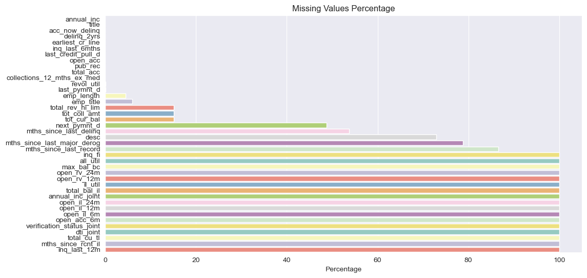

    Gambar 1. Missing Values

    Terdapat banyak fitur yang memiliki missing values, bahkan tidak sedikit fitur yang memiliki persentase missing values hingga 100%.

-   Univariate Analysis

    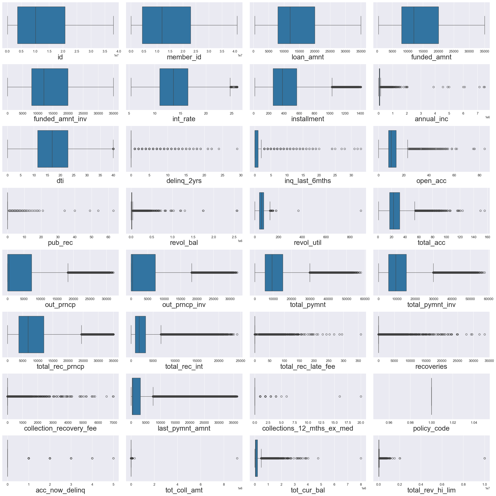

    Gambar 2. Distribusi Fitur Numerik

    Beberapa fitur numerikal memiliki distribusi sebaran yang normal yang berarti data menyebar secara rata, dengan jumlah outlier yang sedikit (contohnya: loan_amnt, funded_amnt). Namun, tidak sedikit pula fitur numerikal yang didominasi oleh nilai outlier, dan hampir semua fitur numerikal yang didominasi oleh outlier memiliki tipe sebaran right skew.

    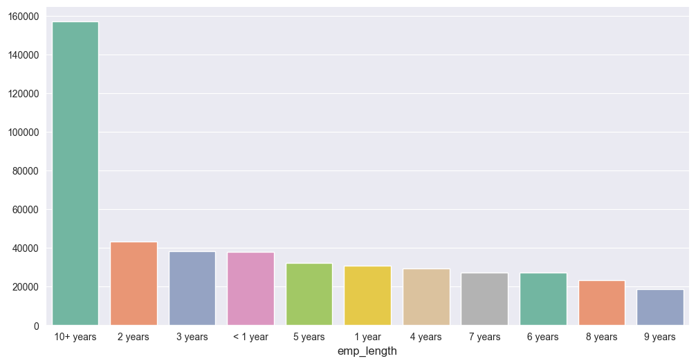

    Gambar 3. Distribusi Fitur Kategorikal

    Terdapat banyak fitur kategorikal, namun, fitur emp_length akan menjadi representasi dari fitur kategorikal. Dapat dilihat bahwa kebanyakan user merupakan seseorang yang sudah bekerja lebih dari 10 tahun 😱.

    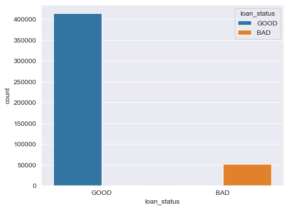

    Gambar 4. Distribusi Label

    Terdapat dua label yang sudah diproses yaitu; GOOD dan BAD. Dapat dilihat bahwa distribusi label tidak seimbang, yaitu label GOOD memiliki jumlah yang jauh lebih banyak dibandingkan label BAD, dengan ratio yang hampir mencapai 9:1.

-   Multiavariate Analysis

    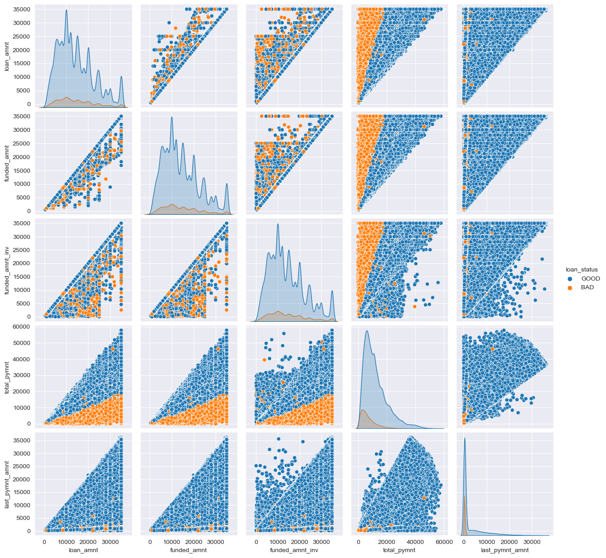

    Gambar 5. Distribusi Fitur Numerikal Berdasarkan Label

    Kebanyakan fitur numerikal tidak saling berhubungan satu dengan yang lainnya dan tersebar secara acak berdasarkan label. Namun, ada beberapa fitur numerikal yang menunjukkan korelasi yang tinggi seperti: total_pymnt dengan loan_amt, funded_amnt, dan funded_amnt_inv.

    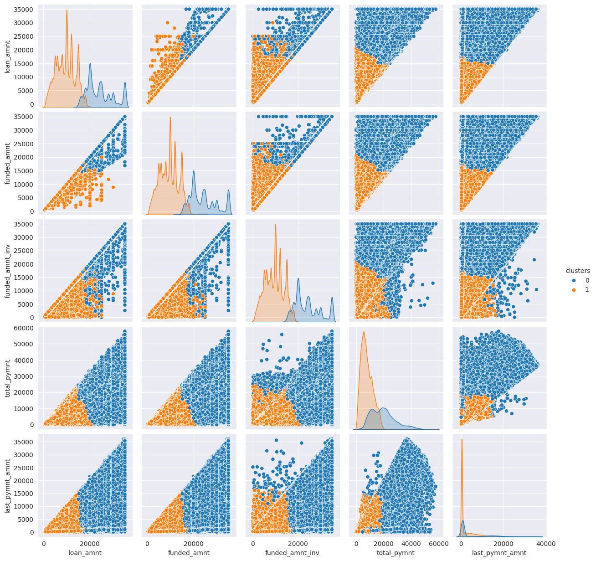

    Gambar 6. Distribusi Fitur Numerikal Menggunakan Clustering

    Terdapat perbedaan yang signifikan jika label menggunakan metode cluster, dimana dengan clustering, semua fitur numerikal menjadi berkorelasi satu dengan yang lainnya. Padahal mayoritas fitur numerikal tidak berkorelasi satu dengan yang lain.

    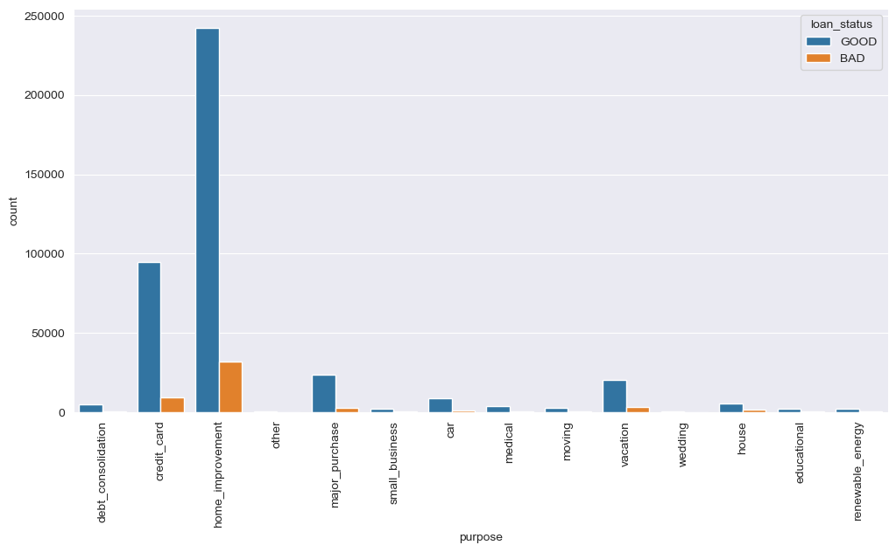

    Gambar 7. Distribusi Fitur Kategorikal Berdasarkan Label

    Melihat dari fitur kategorikal purpose, dapat dilihat bahwa mayoritas peminjaman ditujukan untuk memperbaiki / membangun rumah dan untuk credit card.

    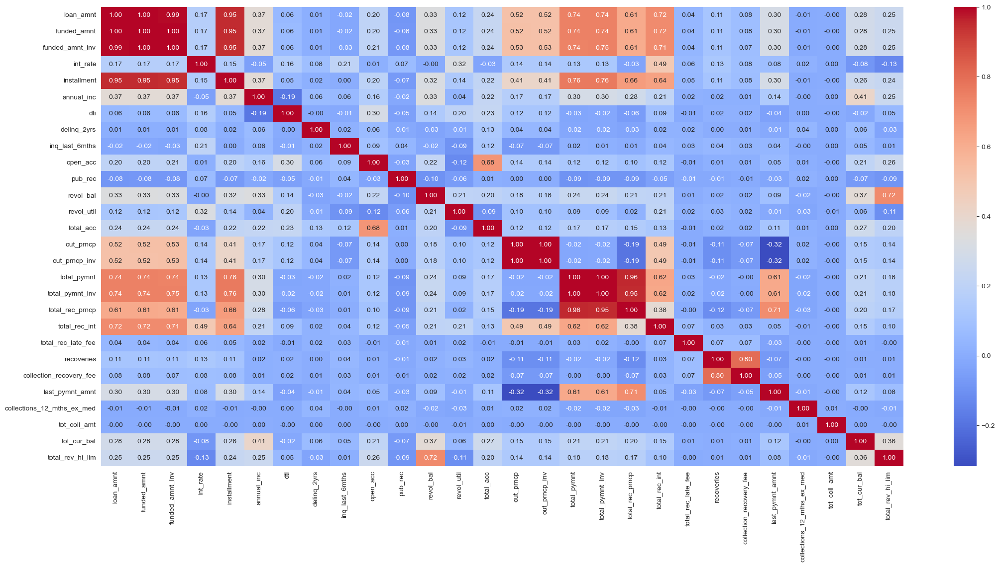

    Gambar 8. Heatmap Korelasi Antar Fitur

    Mengaju pada heatmap, semakin jelas bahwa tidak sedikit fitur yang memiliki korelasi negatif, namun, masih ada beberapa fitur yang berkorelasi positif.

## Data Preparation

### Data preprocessing

1.  Penanganan missing values

    Dapat dilihat pada Gambar 1 bahwa kebanyakan fitur memiliki persentase missing values diatas 50%. Mengingat jumlah data yang sangat besar yaitu 466.285 baris, mengisi fitur dengan persentase missing values yang besar akan menghadirkan bias dan menyebabkan miss klasifikasi. Maka dari itu batas toleransi missing values adalah 16%. Fitur dengan persentase missing values lebih dari 16% akan dibuang, sedangkan sisanya akan dilakukan imputasi. Teknik imputasi yang dilakukan adalah random sampling. Tujuan dari random sampling adalah agar tidak menghasilkan data dengan bias yang tinggi. Selain itu, fitur kategorikal dengan jumlah kategori lebih dari 35 jenis akan dibuang. Hal tersebut dilakukan dengan tujuan mengurangi noise pada data, fitur kategorikal dengan jumlah kategori yang terlalu banyak hanya akan mengurangi performa model dalam mempelajari data. Fitur dengan nilai yang didominasi oleh satu value juga akan dibuang, karena tidak menghasilkan informasi yang penting untuk dipelajari model.

2.  Membuang outlier

    Metode outlier yang digunakan adalah IQR. Terdapat 466.285 baris data sebelum dilakukan penghapusan pada data outlier. Setelah dihapus outlier, jumlah data tersisa 161.794 baris. Melihat banyaknya jumlah data yang terbuang (hampir 75%), maka data outlier akan tetap dipakai dan digunakan.

3.  Labeling

    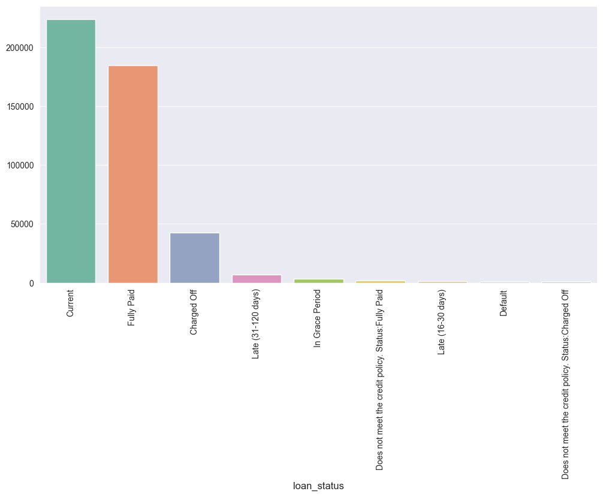

    Gambar 9. Loan Status

    Label pada dataset ini terdapat pada kolom loan_status. Namun, dapat dilihat pada Gambar 9 bahwa terlalu banyak kategori label yang tersedia, dengan distribusi yang tidak seimbang. Maka dari itu, label akan disederhanakan menjadi dua yaitu: GOOD dan BAD, dengan pembagian sebagai berikut:

    -   GOOD: Fully Paid, Does not meet the credit policy. Status:Fully Paid, Current, In Grace Period
    -   BAD: Charged Off, Does not meet the credit policy. Status:Charged Off, Late (16-30 days), Late (31-120 days), Default

    Hasil penyederhanaan label dapat dilihat pada Gambar 4. Dengan begitu, dapat terlihat dengan jelas distribusi data berdasarkan label dan model nantinya dapat lebih baik dalam mempelajari data.

4.  Splitting data

    Data akan displit menjadi data latih dan data uji dengan data uji sebesar 10%. Data latih akan digunakan untuk melatih model, sedangkan data uji akan digunakan untuk mengukur performa model pada data yang belum pernah dilihat sebelumnya.

5.  Feature Reduction

    Setelah melewati berbagai pra-pemrosesan, fitur tereduksi dari 74 fitur menjadi 46 fitur. Namun, jumlah tersebut masih dapat dikatakan banyak. Maka dari itu, fitur dengan nilai korelasi yang tinggi akan direduksi menggunakan metode PCA. Fitur dengan korelasi positif akan digabungkan menjadi satu fitur. Nilai korelasi antar fitur dapat dilihat pada Gambar 8. Hasil akhirnya, fitur tereduksi menjadi 41 fitur.

    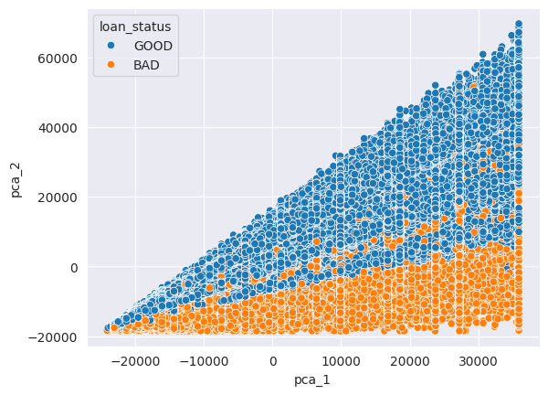

    Gambar 10. Fitur PCA

    Dapat dilihat pada Gambar 10 bahwa fitur yang telah tereduksi masih mempertahankan informasinya dan masih memiliki korelasi yang tinggi, dengan sebaran label yang terlihat dengan jelas.

6.  Standarisasi & Encoding

    Tahapan selanjutnya adalah melakukan standarisasi pada fitur numerikal dan encoding pada fitur kategorikal. Standarisasi bertujuan untuk mengubah skala numerikal agar menjadi sama besar, hal ini bertujuan untuk menghilangkan bias pada fitur tertentu akibat adanya perbedaan skala yang besar. Selanjutnya fitur yang masih dalam bentuk text harus diubah menjadi angka dengan metode encoding. Beberapa fitur kategorikal akan diencode menggunakan One Hot Encoder dan sisanya menggunakan Label Encoder. Proses standarisasi dan encoding akan dilatih pada data latih dan diterapkan pada data latih dan uji. Hal tersebut bertujuan untuk mencegah adanya data leakage, karena model yang secara tidak langsung telah melihat bagian dari data uji.

7.  Penanganan imbalanced label

    Karena terdapat ketidakseimbangan label pada data, maka akan digunakan teknik _over sampling_ dengan metode SMOTE. Kegunaannya adalah agar model dapat mempelajari dengan baik perbedaan antar label. Over sampling hanya dilakukan pada data latih, tujuannya masih sama yaitu mencegah adanya data leakage.

### Modeling

-   Tahapan pertama adalah data preprocessing, di mana data dari dataset dipersiapkan untuk digunakan dalam pembuatan model. Untuk lebih detail sudah dijelaskan pada bagian [data preparation](#data-preparation)

-   Data latih akan disampel sebanyak 25.000 data untuk masing-masing label. Hal ini bertujuan untuk mempercepat proses tuning, dengan tetap menggunakan representasi dari data sebenarnya. Data yang terlalu banyak akan memakan waktu komputasi yang tinggi khususnya pada proses tuning. Data sampel ini akan digunakan untuk proses hyperparameter tuning.

-   2 Algoritma klasifikasi, yaitu; Logistic Regression dan Random Forests, akan dilakukan hyperparameter tuning kemudian dibandingkan menggunakan cross-validation dengan split = 3. Metrik evaluasi yang digunakan adalah f1 score, berikut adalah parameter yang dituning pada setiap model:

    -   Logistic Regression:

        -   penalty: [ l1, l2 ]
        -   C: np.logspace(-4, 4, 20)
        -   solver: [ liblinear, saga ]

    -   Random Forest
        -   n_estimators: [100, 400, 500]
        -   ccp_alpha: [5e-5, 1e-5, 1e-3, 0.1, 1]
        -   max_depth: [32, 64, 128]

    Hyperparameter tuning menghasilkan kombinasi parameter dan nilai f1 sebagai berikut:

    -   Logistic Regression:

        -   penalty: l2
        -   C: 10.000
        -   solver: liblinear
        -   F1 Score: 98.77%

    -   Random Forest:
        -   n_estimators: 100
        -   ccp_alpha: 0.00001
        -   max_depth: 32
        -   F1 Score: 98.42%

    Selanjutnya kedua model akan dites pada keseluruhan data latih dengan parameter yang telah dihasilkan menggunakan cross validation dengan split = 3. Model Logistic Regression mendapatkan rata-rata nilai F1 Score sebesar 95.46%, dan Model Random Forest memperoleh rata-rata nilai F1 Score sebesar 96.33%.

### Evaluation

Model akan dievaluasi pada test set untuk memastikan bahwa model tidak overfit, dan dapat memprediksi data yang belum pernah dilihat secara akurat. Akan dilakukan perbandingan antara model yang dilatih dengan data yang telah di oversample dengan data yang tidak di oversample. Terdapat 4 metrik evaluasi yang digunakan:

-   $ Accuracy = \frac{(TP+TN)}{(TP+TN+FN+FP)} $

-   $ Precision = \frac{TP}{(TP+FP)} $

-   $ Recall = \frac{TP}{(TP+FN)} $

-   $ F1 = \frac{(2*precision*recall)}{(precision+recall)} $

Keterangan:

-   TP (True Positive) = Prediksi 1, Ground Truth 1
-   TN (True Negative) = Prediksi 0, Ground Truth 0
-   FP (False Positive) = Prediksi 1, Ground Truth 0
-   FN (False Negative) = Prediksi 0, Ground Truth 1

Berikut hasil metrics yang diperoleh dari setiap model:

|         | accuracy | precision | recall   | f1_score |
| ------- | -------- | --------- | -------- | -------- |
| lr_over | 0.978533 | 0.984511  | 0.907031 | 0.941379 |
| lr      | 0.976710 | 0.986457  | 0.896543 | 0.935552 |
| rf_over | 0.975037 | 0.985994  | 0.888736 | 0.930354 |
| rf      | 0.976195 | 0.986616  | 0.893909 | 0.933927 |

Tabel 2. Metrics Model

lr merupakan model Logistic Regression, sedangkan rf merupakan model Random Forest. \_over artinya model dilatih menggunakan data oversample, dengan tanpa \_over artinya model dilatih menggunakan data yang tidak di oversample. Dapat dilihat pada Tabel 2 bahwa dari segi akurasi, tidak ada perbedaan antara model yang dilatih pada data oversample dan data asli. Namun, dari segi recall dan f1_score, terdapat sedikit peningkatan untuk model Logistic Regression. Untuk Random Forest, pelatihan dengan data oversample justru menurunkan performa model, Random Forest menghasilkan performa yang lebih baik pada data asli.

1.  Logistic Regression

    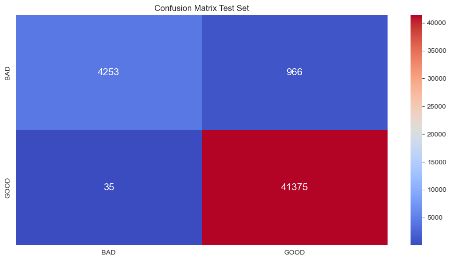

    Gambar 11. Confusion Matrix Logistic Regression Pada Data Uji

    |              | precision | recall | f1-score | support |
    | ------------ | --------- | ------ | -------- | ------- |
    | GOOD         | 0.99      | 0.81   | 0.89     | 5129    |
    | BAD          | 0.98      | 1.00   | 0.99     | 41410   |
    | accuracy     |           |        | 0.98     | 46629   |
    | macro avg    | 0.98      | 0.91   | 0.94     | 46629   |
    | weighted avg | 0.98      | 0.98   | 0.98     | 46629   |

    Tabel 3. Metrics Logistic Regression Pada Data Uji

    Gambar 11 dan Tabel 3 adalah hasil dari model Logistic Regression dengan parameter yang sudah didapat dari hyperparameter tuning dan dilatih pada data latih yang di oversample.

2.  Random Forest

    

    Gambar 12. Confusion Matrix Random Forest Pada Data Uji

    |              | precision | recall | f1-score | support |
    | ------------ | --------- | ------ | -------- | ------- |
    | GOOD         | 1.00      | 0.79   | 0.88     | 5129    |
    | BAD          | 0.97      | 1.00   | 0.99     | 41410   |
    | accuracy     |           |        | 0.98     | 46629   |
    | macro avg    | 0.99      | 0.89   | 0.93     | 46629   |
    | weighted avg | 0.98      | 0.98   | 0.97     | 46629   |

    Tabel 4. Metrics Random Forest Pada Data Uji

    Gambar 12 dan Tabel 4 adalah hasil dari model Random Forest dengan parameter yang sudah didapat dari hyperparameter tuning dan dilatih pada data latih yang tidak di oversample.

Kedua algoritma klasifikasi memberikan hasil yang sangat baik. Secara keseluruhan, kombinasi nilai yang tinggi untuk akurasi, recall, precision, dan F1-score menunjukkan bahwa model Logistic Regression dan Random Forest secara efektif dapat mengklasifikasikan credit risk pada data uji dengan baik. Kinerja model yang tinggi dalam keempat metrik ini mengindikasikan bahwa pendekatan machine learning yang diadopsi telah berhasil dalam menyelesaikan permasalahan klasifikasi yang diangkat, sesuai dengan tujuan proyek. Melihat dari nilai metrik f1-score, dapat disimpulkan bahwa Logistic Regression memiliki performa yang lebih baik daripada Random Forest. Namun, perbedaan nilai f1-score antara Logistic Regression dan Random Forest sangat kecil yaitu 0.01, sehingga perbedaan performa kedua model tidaklah berbeda jauh.
